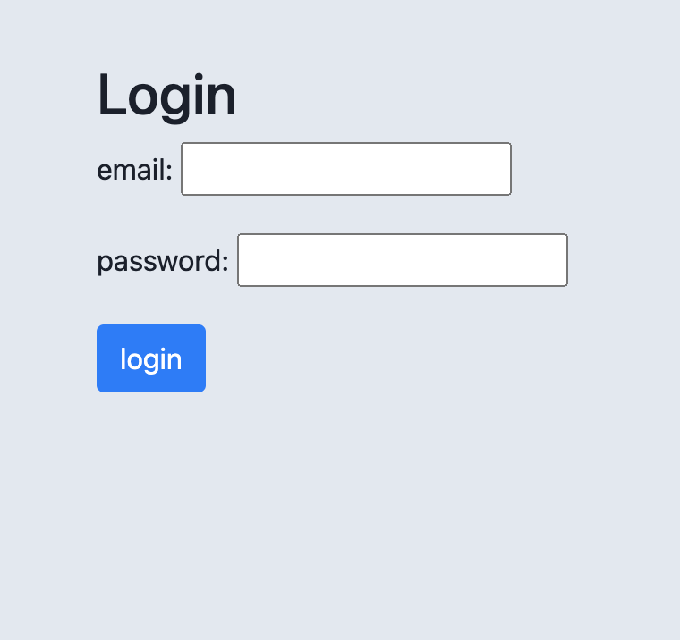
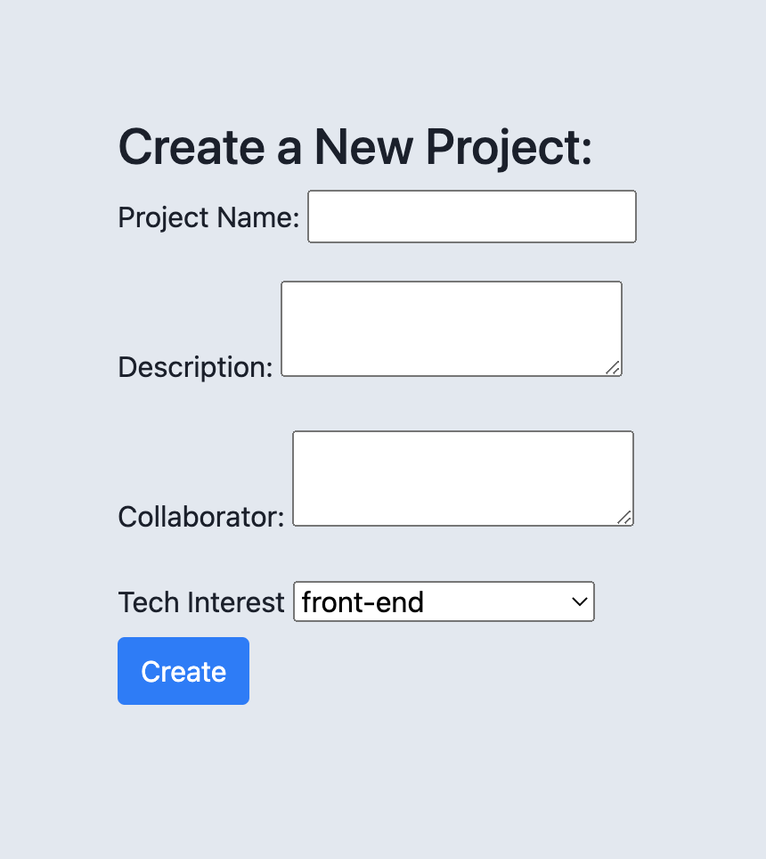
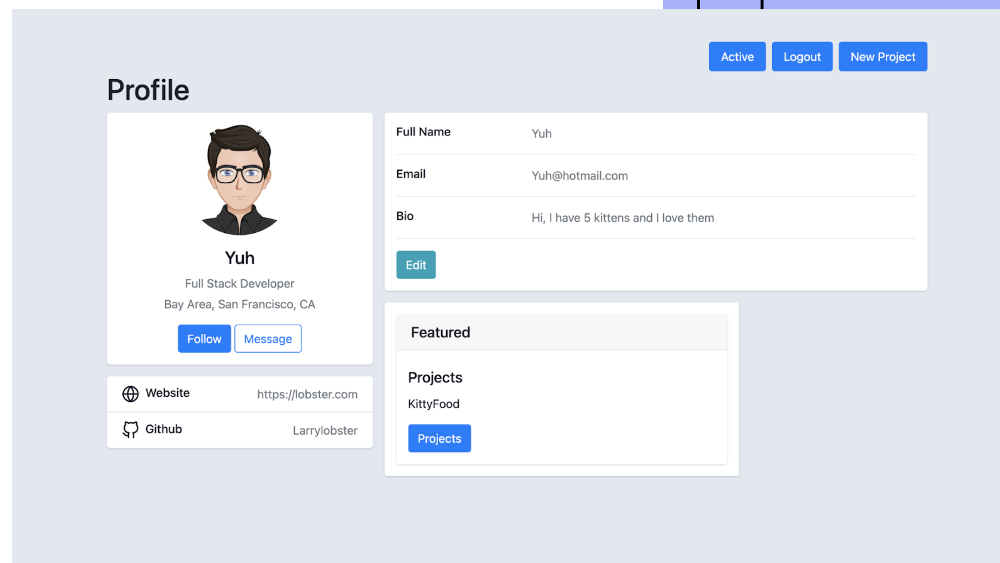
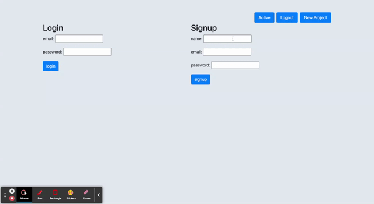

# Software Center
Software Center is a social network site for web developers where people can come together and collaborate on projects. Users can also create their own projects. As well as browse for projects they’re interested in by project name or technology name. This app will also include a contact me section with users github, linkedIn, and portfolio.


# Technologies
- Express
- Express-handlebars
- Express-session
- Helmet
- Mysql2
- Sequelize
- Dotenv
- Bcrypt
- Connect-session-sequelize
- Nodemon
- Heroku

# Deployed Link and URL

- https://github.com/priyarizal/softwareCenter
- https://softwarecenter.herokuapp.com/login

# Significant Code Snippets
Post route to create a user
``` 
router.post('/', async (req, res) => {
    console.log("router hit")
    console.log(req.body)
    try {
        console.log(req)
        const userData = await User.create(req.body);
        req.session.save(() => {
            req.session.user_id = userData.id;
            req.session.logged_in = true;

            res.status(200).json(userData);
        });
    } catch (err) {
        res.status(400).json(err);
    }
});

```

post route to create users login

```
router.post('/login', async (req, res) => {
    console.log('i work')
    try {
        const userData = await User.findOne({ where: { email: req.body.email } });

        if (!userData) {
            res
                .status(400)
                .json({ message: 'Incorrect email or password, please try again' });
            return;
        }

        const validPassword = await userData.checkPassword(req.body.password);

        if (!validPassword) {
            res
                .status(400)
                .json({ message: 'Incorrect email or password, please try again' });
            return;
        }

        req.session.save(() => {
            req.session.user_id = userData.id;
            req.session.logged_in = true;

            res.json({ user: userData, message: 'You are now logged in!' });
        });

    } catch (err) {
        res.status(400).json(err);
    }
});
```

get route to find all projects

```
router.get('/', async (req, res) => {
  try {
    const allProject = await Project.findAll({
      include: [
        {
          model: User,
          attributes: ['name'],
        },
      ],
    });
    const projects = allProject.map((project) => project.get({ plain: true }));
    // attributes : ["id", "name", "description"]
    console.log(allProject)
    res.status(200).json(allProject);
    res.render('/', {
      projects,
      logged_in: req.session.logged_in
    });
  } catch (err) {
    console.log(err)
    res.status(400).json(err);
  }
});
```


Helmet.js docs helped me utilize its middlware contentSecurityPolicy() and crossOriginEmbedderPolicy() to allow usage of image from another website. 


# Screen Shots for overall Design Highlight





# Gif for Demoing Functionality



# Contributors

- Priya Rizal 


# License

- MIT
